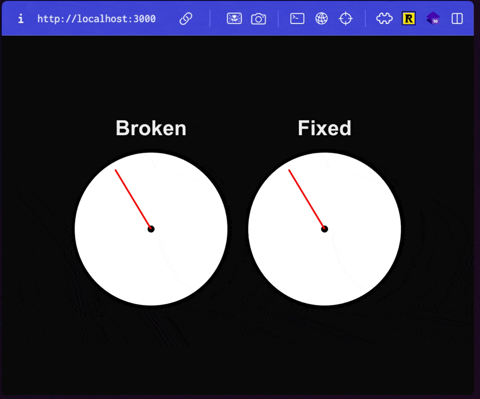
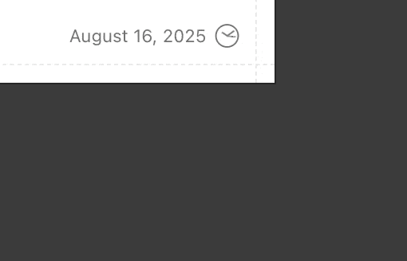

This looks bad, let's fix it!



Hydration is one of those things you wish you never had to think about but it always manages to bite you right when you least expect it.

I present the statically prerendered then hydrated clock, ever present on many a developer blog[^1]:

[^1]: This example is from my good friend Charlie's [site](https://charliemeyer.xyz/). It has since been fixed with the technique from this post!



So why exactly does this happen?

It's due to a combination of 2 factors:

1. Loading a statically (or partially)[^2] pregenerated page
2. A UI component that depends on "request-time" information

[^2]: See Next.js partial prerendering: https://nextjs.org/docs/app/api-reference/config/next-config-js/ppr

When we prerender a page at build time, _something_ has to fill that spot in the UI. But because the "correct" UI to show depends on request time information which we don't have, the solution is often just to leave that part of the UI blank. Or worse, as in this example, show stale data from when the page was rendered.

The thing is we _really_ want to statically generate pages! Serving from a CDN is way faster and makes a really big difference for TTFB and FCP.

But let's say we are willing to give that up and SSR the page. This will address this problem in most cases, but actually not in all! SSR has access to request-time data (full URL, headers, cookies, etc) but not client-only data (local/session storage, browser information, etc)! So we are still out of luck.

You could accept this, and maybe you don't mind the little flicker of the empty state- but dammit I do! I want my CDN cached TTFB and I _need_ that perfect first paint with **no flickers**.


_No JavaScript Sun Tzu! I won't accept it._

Ok well, you saw that GIF at the top of this post- there is a way to fix this.

Now I'll be honest, it's not the most elegant, but it does work: inline script tags.

I mean think about it- we can't _not_ prerender the page, so that HTML is coming down in the stale state no matter what. And we also can't do anything in react land- all of that happens post hydration when the stale state goes away, long past the first visible paint.

But an inline script tag... now that we can put right after the element in the HTML, read any dynamic state we need to, set the element to the correct value, and the browser will parse and run it so quick the user never sees the initial state.

It's perfect! And also slightly horrifying, but we will ignore that for now.

Let's look at an example:

```tsx
function Clock() {
  const [time, setTime] = useState(() => new Date());

  useEffect(() => {
    const timer = setInterval(() => {
      setTime(new Date());
    }, 10);
    return () => clearInterval(timer);
  }, []);

  const secondRotation =
    time.getSeconds() * 6 + time.getMilliseconds() * 0.006;

  return (
    <div>
      <svg width="200" height="200" viewBox="0 0 100 100">
        {/* Clock face */}
        <circle
          cx="50"
          cy="50"
          r="45"
          fill="white"
          stroke="black"
          strokeWidth="2"
        />

        {/* Center dot */}
        <circle cx="50" cy="50" r="2" fill="black" />

        {/* Second hand */}
        <line
          x1="50"
          y1="50"
          x2="50"
          y2="10"
          stroke="red"
          strokeWidth="1"
          transform={`rotate(${secondRotation}, 50, 50)`}
          style={{
            transition: "transform 0.1s linear",
          }}
          id="second-hand"
        />
      </svg>
    </div>
  );
}
```

It has some state which tracks the time, then a svg hand which is animated by setting a rotation style calculated in javascript every 10 milliseconds. This is the exact kind of component that will have a stale initial state if prerendered before hydration where it will see a big jolt as the second hand jumps to the current time.

But pay attention to the `id="second-hand"`, it will be important in a second.

Next we make a second component:

```tsx
function InlineScript() {
  return (
    <script
      dangerouslySetInnerHTML={{
        __html: `(${(() => {
          const secondHand = document.getElementById("second-hand");
          if (!secondHand) {
            console.error("Second hand not found");
            return;
          }
          const time = new Date();
          // Use the same logic as in the Clock component
          const secondRotation =
            time.getSeconds() * 6 + time.getMilliseconds() * 0.006;
          secondHand.setAttribute(
            "transform",
            `rotate(${secondRotation}, 50, 50)`,
          );
        }).toString()})()`,
      }}
    />
  );
}
```

The whole "IIFE + arrow function `toString`ed" is a cool hack to get full typescript support when writing this function, as opposed to literally writing strings. But don't fool yourself here- this is being stringified and inlined. You can't reference anything outside this block besides globals.

In the script, we grab the element by its `id`, then using the exact same logic as we do in our component, calculate and set the state for the rotation attribute on the element.

Then, we just render the component and the script tag after it:

```tsx
export default function Page() {
  return (
    <>
      <Clock />
      <InlineScript />
    </>
  );
}
```

And that's it- no more big jolt. The script tag runs before first paint, so the user never sees the broken initial state from the prerendered page. Nice!

There's a couple things worth noting here.

The first is that while the code won't have any visible flickering, it will still have a react hydration error on the `<line>` element. This is because there is a small gap of time between the inline script tag running and react running, so the `secondRotation` value won't be exactly the same.

If you want to avoid this you can use a react `useState` initializer function to read the initial state from the DOM. This technique is pretty useful for lots of prehydration shenanigans to make sure react "starts up" with the correct state.

```tsx
declare global {
  interface Window {
    __INITIAL_TIME__?: number;
  }
}

function Clock() {
  const [time, setTime] = useState(() => {
    // On client, use the initial time from the inline script
    if (typeof window !== "undefined" && window.__INITIAL_TIME__) {
      return new Date(window.__INITIAL_TIME__);
    }
    // On server, use the current time
    return new Date();
  });

  // ...
}

function InlineScript() {
  return (
    <script
      dangerouslySetInnerHTML={{
        __html: `(${(() => {
          const secondHand = document.getElementById("second-hand");
          if (!secondHand) {
            console.error("Second hand not found");
            return;
          }

          // Set the time used to calculate
          // the initial state for react to read later
          window.__INITIAL_TIME__ = Date.now();
          const time = new Date(window.__INITIAL_TIME__);

          // Use the same logic as in the Clock component
          const secondRotation =
            time.getSeconds() * 6 + time.getMilliseconds() * 0.006;
          secondHand.setAttribute(
            "transform",
            `rotate(${secondRotation}, 50, 50)`,
          );
        }).toString()})()`,
      }}
    />
  );
}
```

Second is that it is _super important_ that whatever logic you have to derive your ui state from your application state **must** be kept in sync between the component body and the inline script tag. Ideally you could move that logic out into a function and share it between the two, but remember you can't import anything into the script tag! So that's not really an option.

If you are using Next.js, the [`instrumentation-client.js`](https://nextjs.org/docs/app/api-reference/file-conventions/instrumentation-client) file can actually help with this, as it will resolve imports and bundle any code, while still running before hydration. However this runs after the entire HTML document has loaded, which may not be fast enough to run before first paint (I like to put these script tags as close after the elements they touch as possible).

In theory, frameworks could do more to support this use case. The last I heard was the React team had "thought about it", so we'll see if anything happens.

I had [explored around recently](https://x.com/ethanniser/status/1953682315412222064) with some api concepts for what a library solution to this could look like. But my solution would require some pretty crazy compiler/bundler hacks to pull out code used in "pre-hydration" sections into its own bundle which is inlined. But this also makes it seem super easy to import a huge library into a script tag, which is a bit of a footgun.

Maybe a library for this is a bad idea because it just isn't a very sustainable pattern. I can quickly imagine this turning into _"well why don't we just ship a super lightweight version of react inline so that we can render certain components unchanged before and after hydration?"_ which seems pretty cursed.

But for now I think this solution is _fine_. I've had to pull it out actually a surprising number of times at this point, so would love to see some more robust longer term solutions.

But play around with this stuff yourself!

Here's some links to the clock example in the GIF and the code snippets:

- [preview](https://hydration-test.vercel.app/)
- [git](https://github.com/ethanniser/hydration-test) (the `window.__INITIAL_TIME__` stuff is on the `no-hydration-warning` branch)
