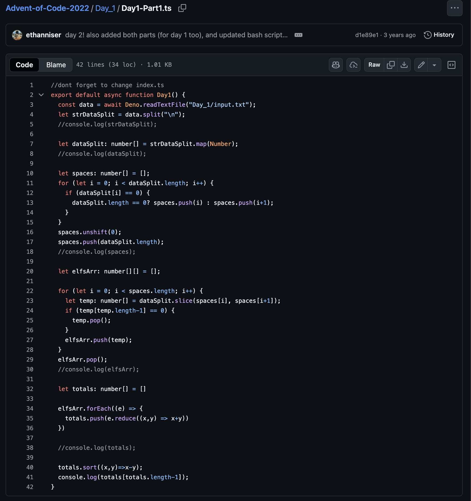
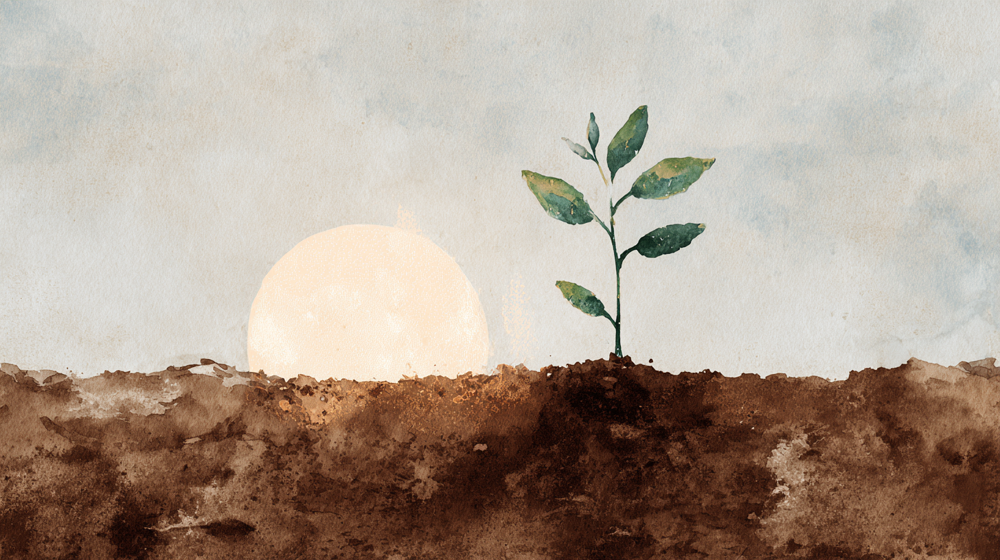

Recently I've really enjoyed reading. Mostly newsletters, but more recently [books](https://x.com/ethanniser/status/1981922394177716420) as well. In a world of endless scrolling on twitter and reels, it feels good to read a structured, fleshed-out, coherent thought.

The things I read are strikingly _good_. They are novel, clear, nuanced and insightful. They are long[^1] and detailed. They say something meaningful. There's something weirdly attractive about good writing. It shows a high level of understanding and intentionality, while still being personal and authentic.

[^1]: To be fair usually saying the same thing in as few words as possible is the most impressive thing you can do as a writer but still to me the length of certain articles or books seems so herculean I basically just view it in awe.

For me going on Substack is like walking into an art museum. Everything is strikingly intricate and beautiful. And when you go home you feel inspired and grab and pen and paper to do a little sketch only to quickly humble yourself.

It's not just the writing itself. I am capable of writing things. I write code everyday. I wrote some philosophy essays in college I thought were pretty good. I'm writing this right now! It's about having something powerful to say, something that leaves the reader truly feeling different than before they read it.

When I look at the writers that most often make me feel this way[^2], their pieces aren't the longest, or the fanciest, or the most novel even (in their core ideas, not necessarily their presentation). But yet I still feel truly captivated by the words. I still don't really know what the formula for how to write things that have this effect is.

[^2]: [Nikunj Kothari](https://writing.nikunjk.com/) and [Joan Westenberg](https://www.joanwestenberg.com/) are both truly excellent in this regard.

Maybe the impressiveness is simply in the novelty. When I started coding, I would read these long technical blogs on fancy personal sites and think "damn this is so cool this guy is a sick developer". And not too long later I have blogs like that of my own[^3], on a [website](https://ethanniser.dev/) I think is rather attractive.

[^3]: [A Clock That Doesn't Snap](https://ethanniser.dev/blog/a-clock-that-doesnt-snap) and [Translating C++ X-macros to Zig Comptime](https://ethanniser.dev/blog/translating-cpp-x-macros-to-zig-comptime)

But the writing I read (and hope one day to write) mostly relates to parts of life I have yet to master in the way I have programming. Things like social dynamics, relationships, feelings, romance, politics and motivation. I truly feel like I just don't have anything fancy, impressive, or impactful to say (especially in a thoughtful and coherent way) right now.

I'm optimistic though.

Over 3 years ago when I started programming I was pretty bad.

_This 40 LOC solution which can easily be done in a [single expression](https://tsplay.dev/NBOOkm). I wrote this on my chromebook in Replit (before it went AI) 3 years ago_

I definitely had nothing fancy to say. Now I have a YouTube channel and twitter followers and a fancy job and a fancy website with a blog. I also have so much more to learn!

I just turned 20 last weekend. I have been in San Francisco less than 9 months in total. Imagine the lessons I will have learned and the insights I can share in 5 years, 10 years, longer yet. Right now I am a sapling. Starting to resemble a tree, but still thin and flexible, and with shallow roots. Some branches are well formed, some others are still growing out, and there's lot of blank space for what will become.

But the ground is fertile, and the sun is shining.

The growth will be inevitable.

