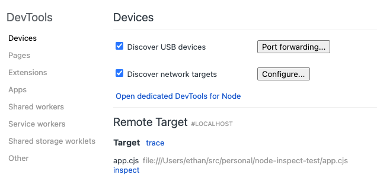
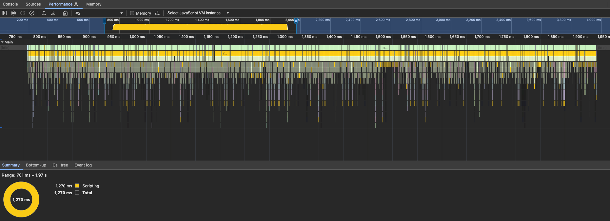
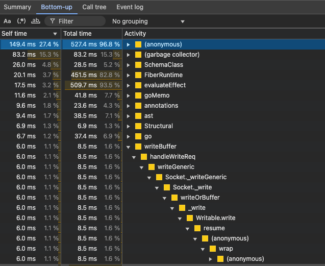
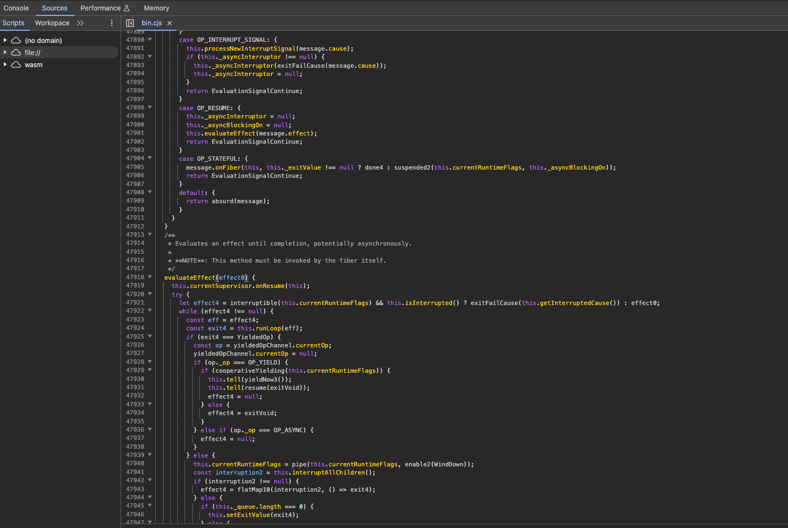
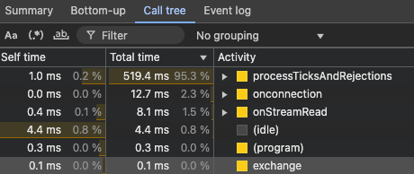
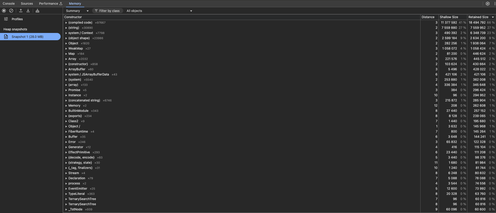

I'm working on a project for my [Effect Days 2025](https://effect.website/events/effect-days) talk, and wanted to look at bit deeper into it's performance.

To be honest, I had never really done this before, but I knew 'flamegraphs' were what I was looking for. Following the reccomendations of the [Node.js docs](https://nodejs.org/en/learn/diagnostics/flame-graphs) I first looked at this cli tool called [0x](https://www.npmjs.com/package/0x). It kind of worked, but felt really outdated and janky.

I looked a bit deeper and found that you can use the full power of the chrome devtools with node apps.

## Profiling with Chrome Devtools

To start, open chrome (or a chromium-based browser) and navigate to [chrome://inspect](chrome://inspect).

_I didn't know this, but you can do everything we're about to do to a node app to any running web page, extension, or service worker all from this page._

Now start your node app with the `--inspect` flag

```bash
node --inspect app.js
```


You should now see the app visible in the inspector target list. Click "inspect" to open the devtools.

Next, open the "Performance" tab and click "Record"



You should now see a flamegraph of your app.

You can zoom in and inspect different regions and timeframes. Clicking on a frame will open it in the "Bottom-up" tab at the bottom.



The bottom-up tab shows you all of the functions called at any point in the selected region on the timeline. Each function has a "self" time, which is the time spent in that function, and a "total" time, which is the time spent in that function and all of its children.

Clicking on a function in this tab will open up the functions where it was called from, and where that function was called from, and so on.

On the right side is the source of that function, which you can click on to open it in "Sources" tab. You might need to disable minification in your bundler config for this to be useful.



Next to it is the "Call tree" tab, which shows you the top-down call tree of the selected region, so only functions that started javascript execution. You can click on them to see the functions they go on to call.



In the "Memory" tab at the top, you can take a heap snapshot and inspect all of the objects in memory, and how large the heap is.



Don't forget to close the debugger when you're done, as the node process will continue running as long as it's attached to the debugger.
