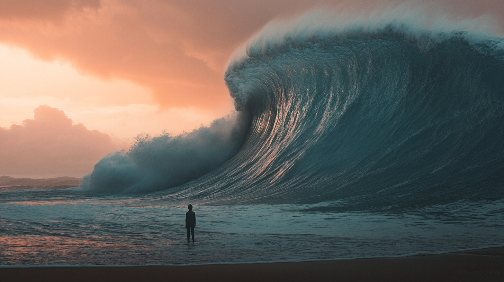

It was always obvious this would be the case, but in the last week it finally hit it me that what it means to be the best software engineer possible has fundamentally and irreversibly changed. Not it will change, it already has, today. Yesterday honestly.

AI is really exciting, and yet some of the first thoughts that came to my mind when I realized this were not exactly positive. Most of this comes down to the fact that **I was really good at the old software engineering**. Being good at something is not only fun, it's powerful. You can make progress faster than others, you can be a trusted voice in the space, and you can take advantage of these to have a bigger impact (and also make a lot of money if that's your thing).

When I look around right now I see two things:

1. A rapidly evolving set of new tools and techniques which others are using faster and more effectively than I am
2. Work that previously would've differentiated me becoming significantly more normalized

If you choose not to evolve, this is a very scary sight to see.

I often try to think about other industries that have seen rapid and extreme evolution. Films used to be edited by hand, splicing and stitching together physical film reels. The people who did that work were probably really good at it. They probably made good money, loved their jobs and would've been completely content doing the same thing forever. And yet when digital cinematography tools arose, if they chose not to evolve, they would've gotten left behind.

That shift followed the exact same patterns: a rapidly evolving new set of tools and techniques, which enabled people who adopted them to do work that previously was differentiating as if it was normal.

The question really comes down to: **do you like cutting film, or do you like making movies?** Because if you like making movies, the digital camera revolution is the best thing that ever happened to you.

Fifty years ago you needed an entire team, tens of thousands of dollars of equipment and weeks of time to make a film. Today, you can shoot, edit and master a film of arguably higher quality with a $500 iPhone all by yourself.

It's okay to like cutting film! People still cut film! But at some point all of the people who liked cutting film had to accept that cutting film was not going to be the skill or the job it once was.

I really did like writing code by hand. It was genuinely very fun. I remember struggling to solve leetcode and advent of code problems typing every character by hand. I remember digging through stack overflow for hours to debug a small, obvious bug. I remember loving tab complete helping me move faster than I ever had before.

But more than all of that, **what I love is building incredible software**.

I started programming to become the best at building software, and that hasn't changed. The same things that got me ahead before: working hard, constantly learning, and producing tangible outputs should suit me well for this new era too.

That is, as long as I choose to not hold back the ocean.

