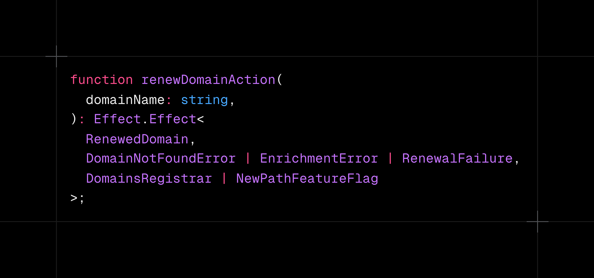
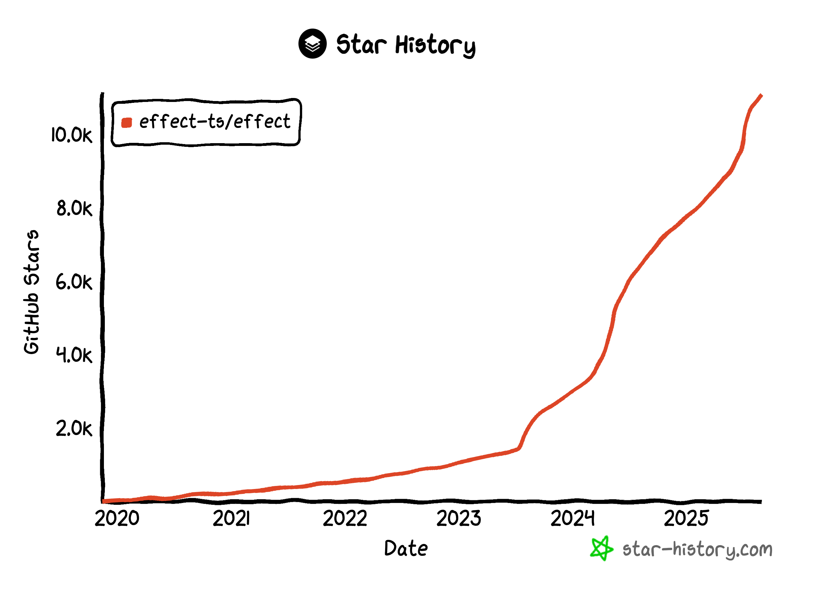

Writing quality software is _complex_, and often _difficult_.

There’s an important distinction there. _Complexity_ is an inherent state of being. Even once understood, _complex_ things remain _complex_. But _difficulty_ is a temporary description of some relation to a task. Once mastered, _difficulty_ melts away.

Writing quality software is _complex_. While many (especially with the rise of AI) are willing to sacrifice quality, I am not. This means we must consider every possible state, and regularly assert and test our assumptions. Our code must be resilient to errors, gracefully handle them and retry where needed. We must effectively utilize concurrency, synchronize between tasks, propagate interruptions, and never leak resources. Our code must be designed in a way that is testable and reusable, while still maintainable and understandable. At runtime, our code must be observable so that when things go wrong so we can precisely identify errors or slowdowns.

Talk about _complexity_ right? It makes sense why surmounting all of this would be _difficult_, so much so that many applications choose to simply not try. And the ones that do quickly find themselves in a web of poorly architected abstractions that ultimately fail to deliver on any of the end goals.

_just one more NPM package please just one more I swear it will finally solve all of our problems_

But things don’t have to be this way. Consider other highly _complex_ things that are not _difficult_: Cutting edge research papers can be less than 10 pages due to the use of sophisticated domain-specific academic language known by most readers. Optimizing vector operations for every kind of GPU is as easy as `model.to(device)`.

Given the right abstraction properly learned, _complex_ things don’t stay _difficult_.

Back to software.

Consider all the _complexity_ from earlier and imagine if it would remain _difficult_ if you programmed using a hypothetical new primitive. The primitive gently guides you in the right direction by default. It splits code up into concise reusable blocks. It tracks errors for you, and makes it simple to handle them when you choose to. It makes it easy to pull code out behind an injectable interface, and forces you to provide an implementation before the code can be run. When you want to utilize a dependency it tracks that usage and makes sure you provide an implementation. There are no “colored functions”, instead concurrency is a core component of the primitive. Concurrency limits are easy to set, concurrent task lifetimes are managed, and interruption propagation and resource management happen automatically. Detailed observability and distributed tracing come out of the box.

Sounds pretty great right? And it gets even better. This new primitive is accessible to you in your favorite language you already use. It works with all of your existing tooling and infrastructure. You can write code in the same imperative style you are used to[^1]. And, while you might lose some of the benefits, it can interop with old code that doesn’t use the primitive without much hassle.

[^1]: https://effect.website/docs/getting-started/using-generators#comparing-effectgen-with-asyncawait

What's the catch? You have to learn something new\! You might have to think about problems in a way you had not before. This might take time before it feels comfortable.

This playbook is not new.

React entered into a world full of imperative, manual DOM manipulation[^2] and proudly claimed it had a better way. The component was a new reusable primitive, with simple, declarative reactivity. At the same time however, it was _weird_\! A new mental model, new syntax, new apis, and a framework that compelled you with its compounding benefits to use it more and more until it consumed your entire app. With JSX, it also asked you to put HTML in your JavaScript and run it through a Babel plugin[^3]\! Unsurprisingly, many people did not exactly want to jump right in.

[^2]: This is mainly referring to JQuery, but I am aware Angular, Ember, Backbone, Knockout and more existed at the time.

[^3]: I promise Effect doesn't go that far (even though they [tried](https://effect.website/blog/ts-plus-postmortem/)).

But a few optimistic folks did. They worked out some kinks, iterated on apis, optimized every drop of performance out of the runtime, and 10 years later React has very clearly [won](https://npmtrends.com/%40angular/core-vs-preact-vs-react-vs-solid-js-vs-svelte-vs-vue). What was once _weird_ is now the **default**. This doesn't mean there aren't very competitive alternatives. It doesn't mean there is never a use case for a little vanilla js JQuery on your blog. Its abstractions may not be perfect, but they sure are powerful: reusable components, declarative \> imperative, a simple user written DSL executed by a deeply _complex_ internal runtime. React has earned its place. There are many apps written in React for which you would rightfully be considered crazy to begin to write in JQuery today.

This is further evident in the massive rise of the "AI Vibe Coding App Builder" market. v0, Lovable, Bolt and Replit all use React when not prompted to choose any particular framework. This is partly because there is lots of training data on React, but also because declarative reactivity plus reusable components and hooks is great for AIs for the _same_ reasons it's great for humans: it reduces _difficulty_ (reactivity, templating, code reusability) when doing _complex_ things (writing web apps).

Consider another great example here: [Convex](https://www.convex.dev/). Convex is a unique TypeScript-based application database with a built-in sync engine. It's quite niche still and AIs have very little training data on it. But despite that disadvantage, Convex's first party AI app builder, Chef, is able to build fullstack applications with an accuracy and quality bar that quite literally [no one else is able to](https://youtu.be/hZeprLzd6xM?si=uFNqyNKoEYqXEMDI). It’s the same playbook: take what was imperative and make it declarative. High level user code executed by a _complex_ internal runtime. Pay the upfront learning cost and get exponential benefits over time. Once again, Convex is great for AIs for the same reasons it's great for humans: it doesn’t make the _complex_ problems of data synchronization, invalidation, and front-to-back wiring disappear, but it makes them so easy by default developers stop needing to constantly think about them.

---

That “hypothetical new primitive” from earlier is actually not hypothetical. It’s called [Effect](https://effect.website/), and it brings this proven playbook to likely the biggest developer market in existence: general TypeScript application development.

The parallels are striking:

- A new primitive, the `Effect` type
- Users write a declarative DSL executed by a _complex_ internal runtime
- Previously _difficult_ things become easy once an upfront “buy-in” cost is paid

_Success, Errors, Requirements. Everything you need to know is in just 1 type_

Handling all of those crucial requirements expected of high-quality software is no longer a game of stringing together 20 different npm packages, but simply using the right existing API from a cohesive framework that's already installed, no refactors required.

Even more importantly for context-limited LLMs, it reduces the context needed to understand a piece of code. Rather than needing to inspect the entire call tree to see what errors might be thrown or to see what global services it accesses, with one LSP call you (or an AI) can see everything you need to know about a block of code.

Consider too that this is the absolute worst AIs will ever be at Effect. Ecosystem implantation happens quickly and forcefully, and Effect’s growth is extremely promising.

Effect’s non-zero upfront cost must not be ignored. While its disclosure of _complexity_ is often overstated[^4], developers will be asked to think with a new mental model, learn new APIs, and deal with interop between existing code. Like React before it, at first Effect might seem _weird_ and scary.

[^4]: Effect has _a lot_ of APIs. Most of them are isolated utility modules or functions you can choose to bring in when they solve a problem you have. The core API surface of Effect is arguably under 20 core functions, with the rest being derivatives of them.

Remember though, this is _difficulty_ and not _complexity_. **Effect is not hard mode**. Its initial _difficulty_ will wane with exposure and use, while the _complexity_ it eases will not.

At the end of the day, Effect is just an NPM package you install and import, but really it's more than that, [Effect is a language](https://ethanniser.dev/blog/the-truth-about-effect). At first, it asks you to learn a new vocabulary. That can feel uncomfortable, even _difficult_. But the payoff is that once you become fluent, you gain a powerful shorthand for handling the hardest parts of software: errors, concurrency, resource management, observability, and testability. Effect doesn’t eliminate the _complexity_ of the world — it gives you the tools to master it.

---

Every so often something new appears with big promises. It's different from the status quo in unique ways. While early adopters swear by it, wider adoption is controversial. It's hard to wrap your head around if you stay tied to old ways of thinking, but a novice who sees it for the first time thinks it's just the norm.

Often the criticism is warranted. This is okay! No technology is above fair critique, no matter how cool, and we must be ready to acknowledge that and start looking for better solutions when the time is right.

But sometimes that new thing really is special. It provides meaningful, enduring value, and is a launchpad for a whole new world of things built on top.

Developers will always ask for faster horses — one more package, one more abstraction. Effect is the car: a fundamentally new approach, and we're only beginning to see its effects.

